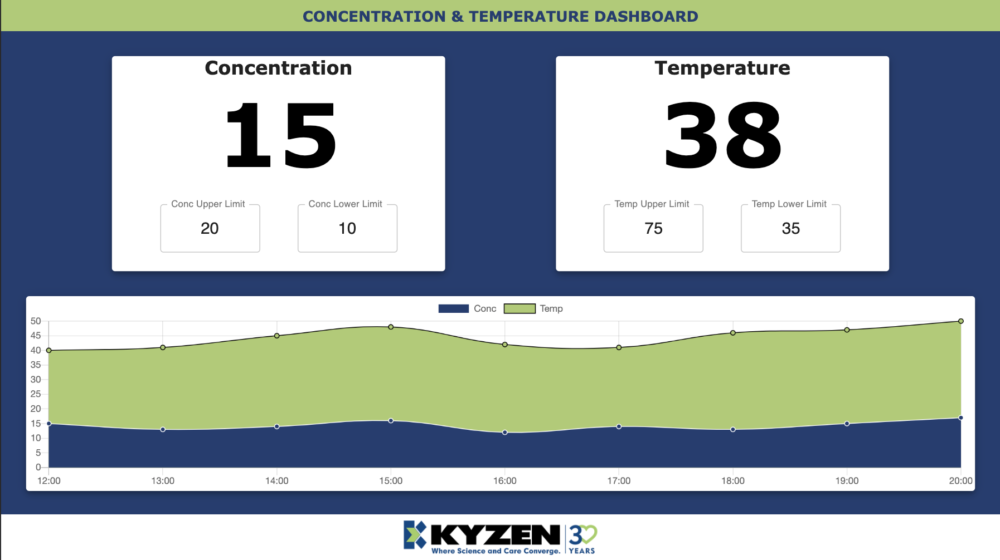
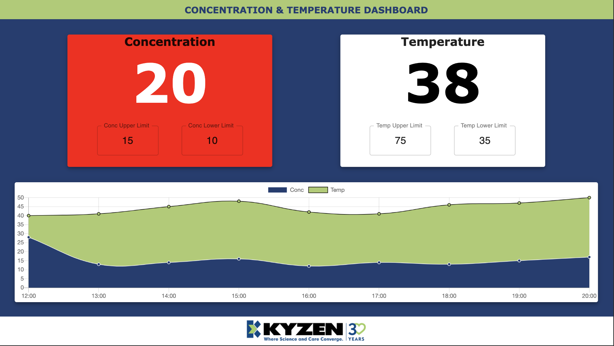
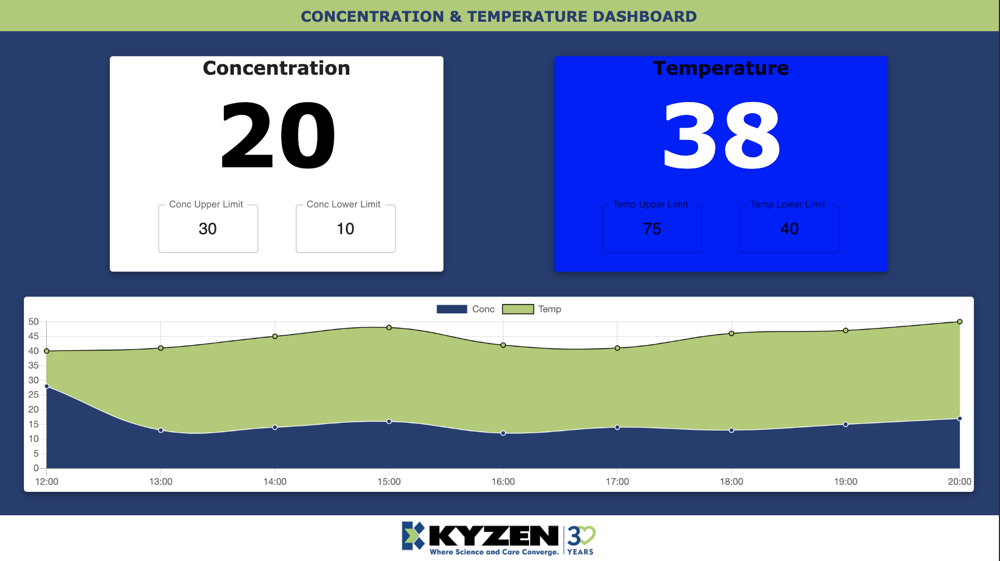

# Dashboard

## Description

A dashboard to display current Concentration and Temperature. Built to run on a 7 inch touchscreen with a resolution of 1280 x 720, it has numeric inputs for both upper and lower limits to set for the Concentration and Temperature levels. If the current level of either the Concentration or the Temperature rises above or below the set limits the background of the card will change color indicating a warning to catch th eye of engineers at a distance.

The dashboard also contains a line chart for historical data that has been statically provided, marking each hour's Concentration and Temperature level readings. Either dataset can be toggled on or off with clicking it's labeled button.

## Live Demo

See a <a href="https://kyzendashboard.herokuapp.com/">live demo here</a> hosted on Heroku.

## Built with

- <a href="https://reactjs.org/docs/getting-started.html">React</a>
- <a href="https://material-ui.com/getting-started/installation/">Material-ui</a>
- <a href="https://www.chartjs.org/docs/latest/">Chart.js</a>
- <a href="https://nodejs.org/en/">Node</a>

## To get started

To get started after cloning run:

    npm install

to install all dependencies.

Then navigate to the root folder and run:

    npm start

to start the React server usually on port 3000

## Images

### Everything is running smoothly, no warnings

 

### Warning, over limit

 

### Warning, under limit

